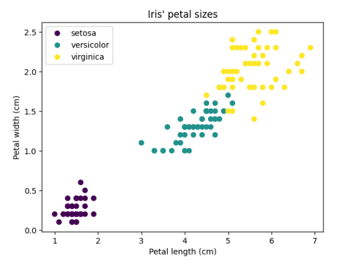

# Отчёт по лабораторной работе 2 «Вычисление массы протеинов»

## Цель
Определить массу протеина, который будет задан в виде строчки из аминокислот, где каждой аминокислоте соответствует определенная масса

## Задача
Дана протеиновая последовательность. Нужно:
- создать словарь, который будет содержать массы аминокислот.
- создать алгоритм, который будет проверят размер заданной последовательности.
- в случае, если последовательность состоит меньше чем из 1000 символов, вычислить массу этой последовательности, которая равна сумме моноизотопных масс всех аминокислот, потому что данном контексте предполагается, что пептиды извлечены из середины протеина, поэтому все аминокислоты рассматриваются как остатки.

## Алгоритм решения
Я написала класс Protein, чтобы можно было посчитать массу протеина по введённой последовательности аминокислот. В конструкторе я создала словарь, где каждой аминокислоте соответствует её масса, а также записала массу одной молекулы воды. Это нужно, так как при соединении аминокислот образуются пептидные связи, и при каждой связи выделяется вода. Схема образования пептидной связи изображена ниже:

В методе calculate_mass я прохожу по каждому символу последовательности, складываю массы аминокислот, затем вычитаю массу воды для каждой связи (а связей получается столько, сколько аминокислот минус один), и в итоге добавляю одну молекулу воды обратно – это отражает тот факт, что крайние аминокислоты не теряют воду. Метод get_sequence запрашивает у пользователя последовательность аминокислот, проверяя, что она короче 1000 символов. Если последовательность слишком длинная, просит ввести другую. Метод get_sequence_mass получает введённую последовательность, вычисляет её массу через calculate_mass, и выводит результат. Если пользователь ввёл неправильный символ, которого нет в словаре, выводится сообщение об ошибке. В конце создаётся объект класса Protein и вызывается метод для получения и вывода массы протеина.
