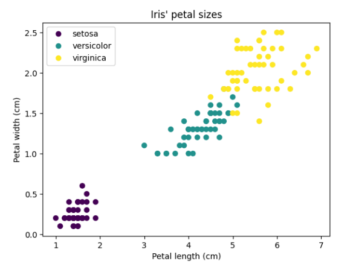

# Отчёт по лабораторной работе 3 «Построение диаграммы рассеяния»

## Цель:
Построить диаграмму рассеяния на основе выбранных данных.

## Задача
Заданы некоторые табличные данные. В них надо выбрать два столбца (фактора), на их основе построить диаграмму рассеяния, причём маркеры
должны иметь различные цвета в зависимости от принадлежности к определённому классу. В результате должен получиться график наподобие того, что приведён на рисунке ниже:

## Алгоритм решения
Я использовала библиотеки NumPy, Pandas, Matplotlib и набор данных Iris из sklearn. Сначала данные об ирисах были загружены, и на их основе я создала DataFrame с добавленным столбцом, который хранит классы (виды ирисов). Затем я выбрала два признака: длину чашелистика для оси X и длину лепестка для оси Y, чтобы каждая точка на графике отражала отдельный образец. При построении диаграммы рассеяния я использовала функцию plt.scatter, где цвет точек определяется их классом с помощью цветовой карты "viridis", а также задал размер точек, их прозрачность и чёрные границы для лучшей визуализации. Далее я добавила заголовок, подписи осей и сетку, а для создания понятной легенды вручную добавила для каждого класса невидимые точки с нужным цветом и подписью, чтобы показать соответствие цвета и вида ирисов. В завершение, с помощью plt.tight_layout() я настроила расположение всех элементов на графике, и вызов plt.show() отобразил итоговый график, который прикреплен ниже:

